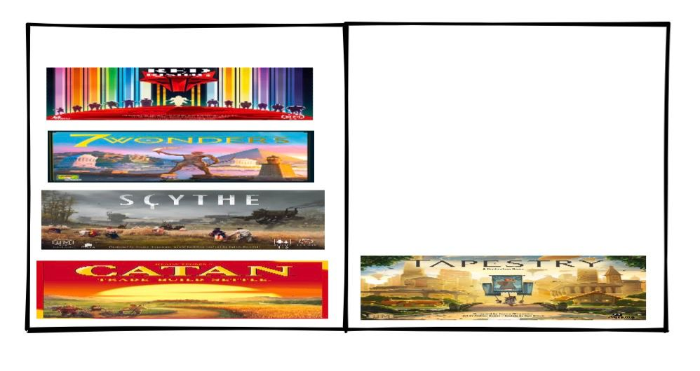
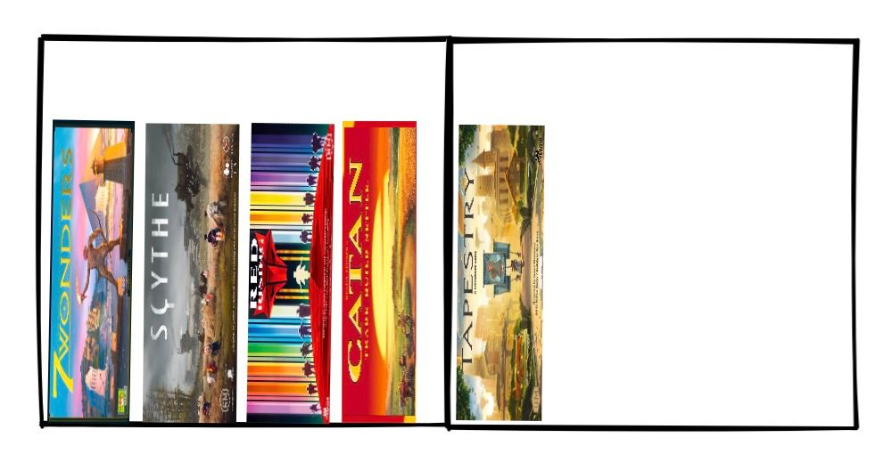
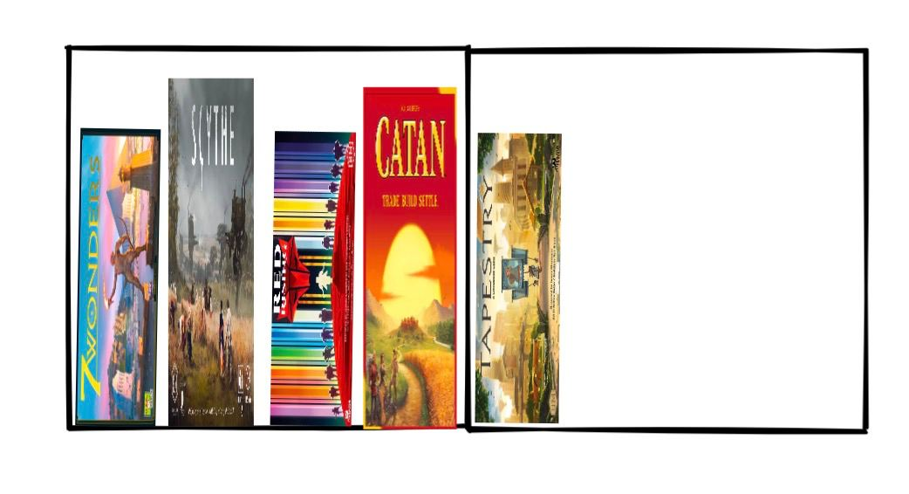
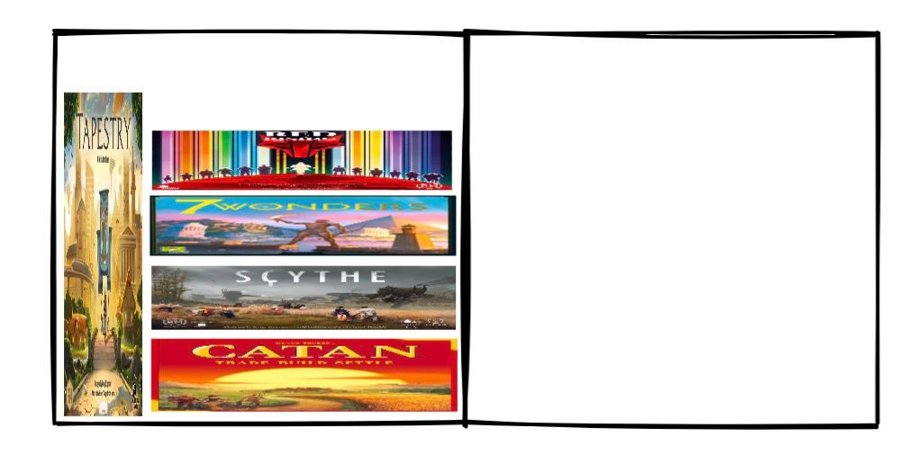
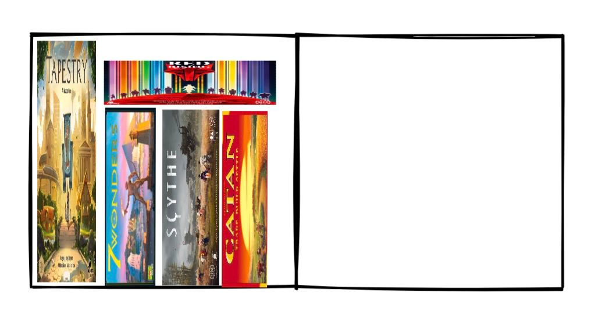
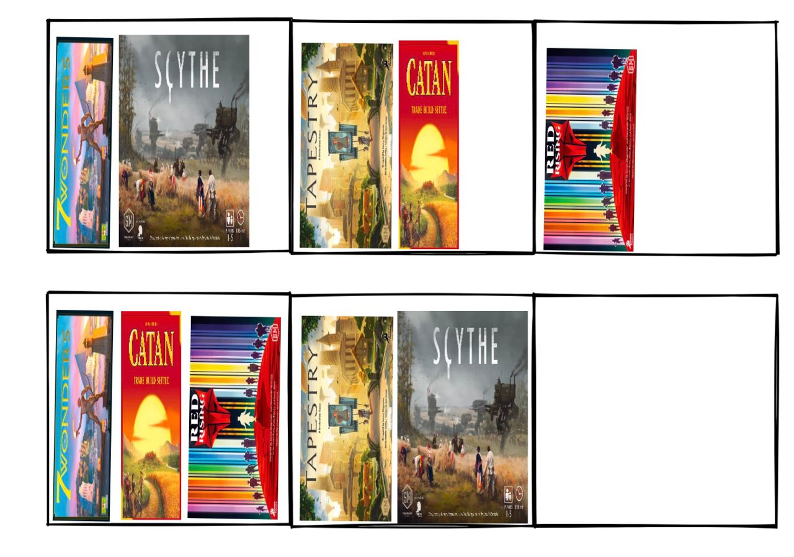

## Goal

You have opened a new board games store, and you have a whole collection to organize in different shelves around the store.

The board games sorter is a tool used to organize your board games into shelves of custom size.

Given a collection of board games, you will build a piece of code that sorts them using different criterias.

> **You can never place a game that does not fit vertically or horizontally in the shelves**. For now, depth of the shelves will not be taken into account.

### Level 1

Sort all of the games following this criteria:

- All games will be **placed vertically**; that is, with their front cover facing the right side of the shelf.
- There will be no games covered by other games, so just one game even if another fits behind the one at the front.

### Level 2

Consider you can select the games **placement** to be vertical or horizontal. If you select horizontal, sort all of the games following this criteria:

- All games can be placed horizontally; that is, with their front cover looking at the top side of the shelf, and **rotated** to the front. If you were to pick up a game, you would see its cover correctly.
- There will be no games next to other games, just on top or under other games.

### Level 3

Consider you can **rotate** the games so their front cover is oriented to one of the sides of the shelves. Follow this criteria:

- All of the games must follow the same rules of placement and orientation.
- There will be no games next to (if placed horizontally) or behind other games (if placed vertically).

### Level 4

Given a constant placement orientation, **consider you can rotate or not each game**.

### Level 5

Given a constant rotation criteria, **consider you can change the placement orientation of each game**.

### Level 6

Consider you can **freely change placement and orientation for each game**.

### Level 7

There is be the possibility that you can complete all the previous levels with a non-efficient board games sorter, that is because there could be free space in some of the shelves after sorting all of the games.

Consider you can still **freely change placement and orientation for each game** and make the necessary changes to make the most of the space available. In other words, occupy the less amount of shelves, and fill the shelves as much as possible with games.

